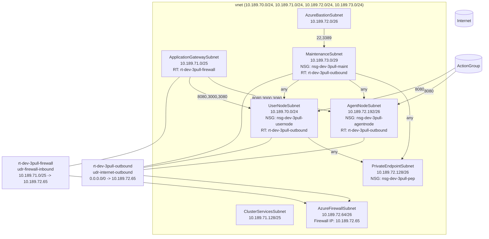

# 仮想ネットワーク

| 仮想ネットワーク名                  | リソースグループ名                   | 場所       | アドレス空間          | DNSサーバー | DDoS Protection | DDoS保護計画 |
| ----------------------------------- | ------------------------------------ | ---------- | --------------------- | ----------- | --------------- | ------------ |
| vnet-[environmentName]-[systemName] | rg-[environmentName]-[systemName]-nw | [location] | [vnetAddressPrefixes] | Azure提供   | 有効化          | -            |

- ※[]内は`infra/common.parameter.json`の設定値に従って設定されます。
- ※DDoS Protection は `ddosProtectionPlanId` を指定した場合のみ有効化されます。
- ※最低限、以下のいずれかのアドレスレンジが必要です。
  - `/24` が 4 つ分
  - 連続するサブネットレンジを確保できる場合は `/23` が 2 つ分、もしくは、`/22` が 1 つ分（`/24` 4 つ分相当）
- ※`sharedBastionIp` を指定して VNET 外の踏み台 IP を利用する場合は、`/24` が 3 つ分でも構成可能です。

# サブネット

| サブネット名               | プレフィクス | サービスエンドポイント | NSG名                                        | ルートテーブル名                           | 備考                                   |
| -------------------------- | ------------ | ---------------------- | -------------------------------------------- | ------------------------------------------ | -------------------------------------- |
| `UserNodeSubnet`           | `/24`        |                        | nsg-[environmentName]-[systemName]-usernode  | rt-[environmentName]-[systemName]-outbound | アプリデプロイ領域                     |
| `ApplicationGatewaySubnet` | `/25`        |                        |                                              | rt-[environmentName]-[systemName]-firewall | AGIC用サブネット                       |
| `ClusterServicesSubnet`    | `/25`        |                        |                                              |                                            | AKSのサービスCIDR用空きサブネット      |
| `AgentNodeSubnet`          | `/26`        |                        | nsg-[environmentName]-[systemName]-agentnode | rt-[environmentName]-[systemName]-outbound | AKSのエージェントノード用サブネット    |
| `PrivateEndpointSubnet`    | `/26`        |                        | nsg-[environmentName]-[systemName]-pep       |                                            | プライベートエンドポイント用サブネット |
| `AzureFirewallSubnet`      | `/26`        |                        |                                              |                                            | ファイヤーウォール用サブネット         |
| `AzureBastionSubnet`       | `/26`        |                        |                                              |                                            | Bastion用サブネット（`sharedBastionIp` 未指定時のみ） |
| `MaintenanceSubnet`        | `/29`        |                        | nsg-[environmentName]-[systemName]-maint     | rt-[environmentName]-[systemName]-outbound | メンテVM用サブネット                   |

※ 以下のサブネットへのネットワークセキュリティグループの設定はAzure非推奨であり予期せぬエラーが発生する可能性があるため設定しません。

- `ClusterServicesSubnet`
- `AzureFirewallSubnet`
- `ApplicationGatewaySubnet`
- `AzureBastionSubnet`

# 構成図（生成パラメータ例）

以下は `infra/log/tmp-*-20260215T120923.json` を基にした構成図です。

# ルートテーブル

## アウトバウンド通信

ハブ&スポーク構成などで **集約された FW 経由のアウトバウンド**が必要な場合、  
`infra/common.parameter.json`の`egressNextHopIp` に IP を指定すると **ユーザー定義ルート (UDR)** が作成されます。  
これにより AKS からの外向き通信経路を制御できます。  
`egressNextHopIp` を指定しない場合は[設置したFirewallのプライベートIP]をインターネット向けアウトバウンド通信のネクストホップとして指定します。

## インバウンド通信

TLS検査を有効化するためApplication GatewayからAzure Firewallを経由させる構成とします。
また、FW を前面に置くと **NAT で送信元が変わり**、AppGW + WAF が **クライアント情報を正しく識別できなくなる**ためです。  
そのため、AppGW + WAF を前面に配置し、FW を経由して AKS に到達する構成にしています。

## rt-[environmentName]-[systemName]-firewall

AGWからインバウンド用FWへの通信

| ルート名             | アドレスプレフィックス     | ネクストホップの種類 | ネクストホップ                     |
| -------------------- | -------------------------- | -------------------- | ---------------------------------- |
| udr-firewall-inbound | `ApplicationGatewaySubnet` | 仮想アプライアンス   | [設置したFirewallのプライベートIP] |

## rt-[environmentName]-[systemName]-outbound

AKSからアウトバウンドへの通信

| ルート名              | アドレスプレフィックス | ネクストホップの種類 | ネクストホップ                                          |
| --------------------- | ---------------------- | -------------------- | ------------------------------------------------------- |
| udr-internet-outbound | 0.0.0.0/0              | 仮想アプライアンス   | [egressNextHopIp] or [設置したFirewallのプライベートIP] |

# ネットワークセキュリティグループ

## 命名規則

ルールの目的を明確に示すように、わかりやすい名前を付ける。
[Allow/Deny]-[プロトコル]-[From/To]-[ソース/宛先]

## 優先度について

ルールの優先度については、以下ルールに従って優先度範囲ごとに連番で付ける。
| 優先度範囲 | 用途 | 説明 |
|------|------|------|
| 100~199 | 優先ルール　　 | 200番以降のルールよりさらに優先すべきルールがある場合の枠 |
| 200~4095 | カスタムルール | プロダクトごとに必要な通信を都度追加する　　　　　　　 |
| 4096 | 最終拒否　　　 | 上記以外すべての通信を拒否　　　　　　　　　　　　　　 |

## デフォルトルール

以下のルールはリソース作成時に自動的に作成される、編集不可のデフォルトルールを表す。
すべてのリソースに含まれるため、以下ルールを個別に記述しない。

### 受信セキュリティ規則

| ソース      | ソースIPアドレス/CIDR範囲,ソースサービスタグ,ソースアプリケーションのセキュリティグループ | ソースポート範囲 | 宛先        | 宛先IPアドレス/CIDR範囲,宛先サービスタグ,宛先アプリケーションのセキュリティグループ | サービス | 宛先ポート範囲 | プロトコル | アクション | 優先度 | 名前                          | 説明 |
| ----------- | ----------------------------------------------------------------------------------------- | ---------------- | ----------- | ----------------------------------------------------------------------------------- | -------- | -------------- | ---------- | ---------- | ------ | ----------------------------- | ---- |
| Service Tag | VirtualNetwork                                                                            | \*               | Service Tag | VirtualNetwork                                                                      | Custom   | \*             | Any        | 許可       | 65000  | AllowVnetInBound              |      |
| Service Tag | AzureLoadBalancer                                                                         | \*               | Any         | -                                                                                   | Custom   | \*             | Any        | 許可       | 65001  | AllowAzureLoadBalancerInBound |      |
| Any         | -                                                                                         | \*               | Any         | -                                                                                   | Custom   | \*             | Any        | 拒否       | 65500  | DenyAllInBound                |      |

### 送信セキュリティ規則

| ソース      | ソースIPアドレス/CIDR範囲,ソースサービスタグ,ソースアプリケーションのセキュリティグループ | ソースポート範囲 | 宛先        | 宛先IPアドレス/CIDR範囲,宛先サービスタグ,宛先アプリケーションのセキュリティグループ | サービス | 宛先ポート範囲 | プロトコル | アクション | 優先度 | 名前                  | 説明 |
| ----------- | ----------------------------------------------------------------------------------------- | ---------------- | ----------- | ----------------------------------------------------------------------------------- | -------- | -------------- | ---------- | ---------- | ------ | --------------------- | ---- |
| Service Tag | VirtualNetwork                                                                            | \*               | Service Tag | VirtualNetwork                                                                      | Custom   | \*             | Any        | 許可       | 65000  | AllowVnetOutBound     |      |
| Any         | -                                                                                         | \*               | Service Tag | Internet                                                                            | Custom   | \*             | Any        | 許可       | 65001  | AllowInternetOutBound |      |
| Any         | -                                                                                         | \*               | Any         | \*                                                                                  | Custom   | \*             | Any        | 拒否       | 65500  | DenyAllOutBound       |      |

## nsg-[environmentName]-[systemName]-usernode

### 受信セキュリティ規則

| ソース       | ソースIPアドレス/CIDR範囲,ソースサービスタグ | ソースポート範囲 | 宛先 | 宛先IPアドレス/CIDR範囲,宛先サービスタグ | サービス | 宛先ポート範囲 | プロトコル | アクション | 優先度 | 名前                          | 説明                             |
| ------------ | -------------------------------------------- | ---------------- | ---- | ---------------------------------------- | -------- | -------------- | ---------- | ---------- | ------ | ----------------------------- | -------------------------------- |
| IPアドレス　 | `UserNodeSubnet`, `AgentNodeSubnet`          | \*               | Any  | -                                        | Custom   | 443,4443       | TCP        | 許可       | 200    | Allow-HTTPS-From-K8SAPIServer | K8SAPIサーバーからの通信許可     |
| IPアドレス　 | `ApplicationGatewaySubnet`                   | \*               | Any  | -                                        | Custom   | 8080,3000,3080 | HTTP       | 許可       | 201    | Allow-HTTP-From-AgwSubnet     | ApplicationGatewayからの通信許可 |
| IPアドレス　 | `MaintenanceSubnet`                          | \*               | Any  | -                                        | Custom   | \*             | Any        | 許可       | 202    | Allow-Any-From-MaintVmSubnet  | メンテナンス用VMからの通信許可   |
| Service Tag  | ActionGroup                                  | \*               | Any  | -                                        | Custom   | 8080           | Any        | 許可       | 203    | Allow-8080-From-ActionGroup   | ログ収集のための通信許可         |
| Any          | -                                            | \*               | Any  | -                                        | Custom   | \*             | Any        | 拒否       | 4096   | DenyAll                       | その他全ての通信拒否             |

## nsg-[environmentName]-[systemName]-agentnode

### 受信セキュリティ規則

| ソース       | ソースIPアドレス/CIDR範囲,ソースサービスタグ | ソースポート範囲 | 宛先 | 宛先IPアドレス/CIDR範囲,宛先サービスタグ | サービス | 宛先ポート範囲 | プロトコル | アクション | 優先度 | 名前                          | 説明                             |
| ------------ | -------------------------------------------- | ---------------- | ---- | ---------------------------------------- | -------- | -------------- | ---------- | ---------- | ------ | ----------------------------- | -------------------------------- |
| IPアドレス　 | `AgentNodeSubnet`                            | \*               | Any  | -                                        | Custom   | 443,4443       | TCP        | 許可       | 200    | Allow-HTTPS-From-K8SAPIServer | K8SAPIサーバーからの通信許可     |
| IPアドレス　 | `ApplicationGatewaySubnet`                   | \*               | Any  | -                                        | Custom   | 8080,3000,3080 | HTTP       | 許可       | 201    | Allow-HTTP-From-AgwSubnet     | ApplicationGatewayからの通信許可 |
| IPアドレス　 | `MaintenanceSubnet`                          | \*               | Any  | -                                        | Custom   | \*             | Any        | 許可       | 202    | Allow-Any-From-MaintVmSubnet  | メンテナンス用VMからの通信許可   |
| Service Tag  | ActionGroup                                  | \*               | Any  | -                                        | Custom   | 8080           | Any        | 許可       | 203    | Allow-8080-From-ActionGroup   | ログ収集のための通信許可         |
| Any          | -                                            | \*               | Any  | -                                        | Custom   | \*             | Any        | 拒否       | 4096   | DenyAll                       | その他全ての通信拒否             |

## nsg-[environmentName]-[systemName]-pep

### 受信セキュリティ規則

| ソース       | ソースIPアドレス/CIDR範囲,ソースサービスタグ | ソースポート範囲 | 宛先 | 宛先IPアドレス/CIDR範囲,宛先サービスタグ | サービス | 宛先ポート範囲 | プロトコル | アクション | 優先度 | 名前                         | 説明                           |
| ------------ | -------------------------------------------- | ---------------- | ---- | ---------------------------------------- | -------- | -------------- | ---------- | ---------- | ------ | ---------------------------- | ------------------------------ |
| IPアドレス　 | `UserNodeSubnet`                             | \*               | Any  | -                                        | Custom   | \*             | Any        | 許可       | 200    | Allow-Any-From-AksSubnet     | Aksからの通信許可              |
| IPアドレス　 | `MaintenanceSubnet`                          | \*               | Any  | -                                        | Custom   | \*             | Any        | 許可       | 201    | Allow-Any-From-MaintVmSubnet | メンテナンス用VMからの通信許可 |
| Any          | -                                            | \*               | Any  | -                                        | Custom   | \*             | Any        | 拒否       | 4096   | DenyAll                      | その他全ての通信拒否           |

### 送信セキュリティ規則

| ソース      | ソースIPアドレス/CIDR範囲,ソースサービスタグ,ソースアプリケーションのセキュリティグループ | ソースポート範囲 | 宛先        | 宛先IPアドレス/CIDR範囲,宛先サービスタグ,宛先アプリケーションのセキュリティグループ | サービス | 宛先ポート範囲 | プロトコル | アクション | 優先度 | 名前              | 説明 |
| ----------- | ----------------------------------------------------------------------------------------- | ---------------- | ----------- | ----------------------------------------------------------------------------------- | -------- | -------------- | ---------- | ---------- | ------ | ----------------- | ---- |
| Service Tag | VirtualNetwork                                                                            | \*               | Service Tag | VirtualNetwork                                                                      | Custom   | \*             | Any        | 許可       | 200    | Allow-Any-To-Vnet |      |
| Any         | -                                                                                         | \*               | Any         | \*                                                                                  | Custom   | \*             | Any        | 拒否       | 4096   | Deny-Any-To-All   |      |

## nsg-[environmentName]-[systemName]-maint

### 受信セキュリティ規則

| ソース       | ソースIPアドレス/CIDR範囲,ソースサービスタグ | ソースポート範囲 | 宛先 | 宛先IPアドレス/CIDR範囲,宛先サービスタグ | サービス | 宛先ポート範囲 | プロトコル | アクション | 優先度 | 名前                         | 説明                         |
| ------------ | -------------------------------------------- | ---------------- | ---- | ---------------------------------------- | -------- | -------------- | ---------- | ---------- | ------ | ---------------------------- | ---------------------------- |
| IPアドレス　 | [sharedBastionIp] または [AzureBastionSubnet] | \*               | Any  | -                                        | Custom   | 22,3389        | TCP        | 許可       | 200    | Allow-SSH-RDP-From-BastionServer | 踏み台からの SSH/RDP 通信許可 |
| Any          | -                                            | \*               | Any  | -                                        | Custom   | \*             | Any        | 拒否       | 4096   | DenyAll                      | その他全ての通信拒否         |

`sharedBastionIp` を指定した場合は [sharedBastionIp] からの通信を許可し、未指定の場合は [AzureBastionSubnet] からの通信を許可します。
