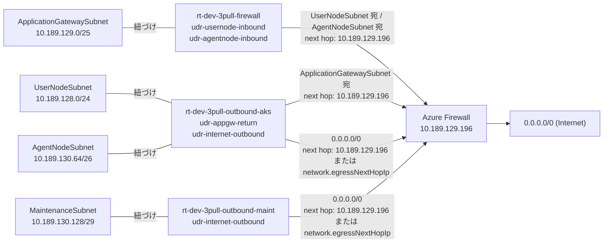
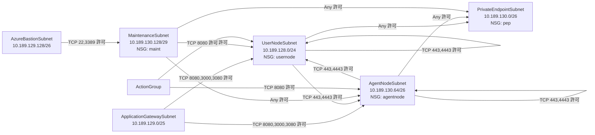
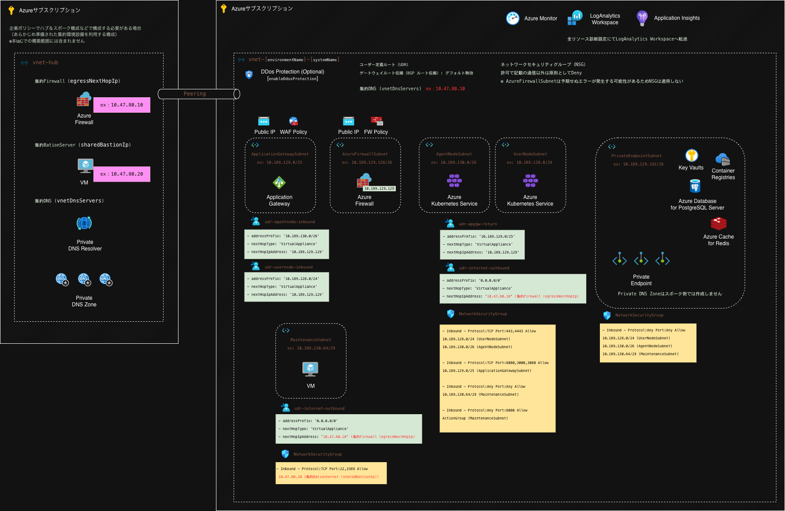
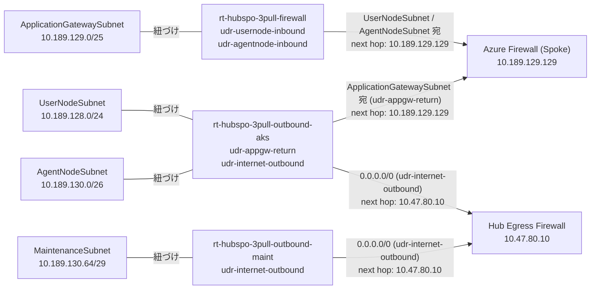
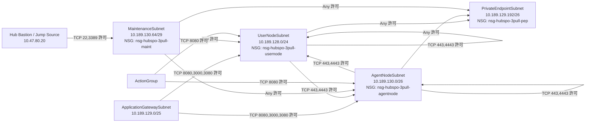

# infra README

このディレクトリは、Azure インフラを Bicep でデプロイする実行基盤です。  
`main.sh` が `common.parameter.json` を読み込み、前処理で `.bicepparam` を動的生成して各リソースをデプロイします。

## ネットワーク構成図とフロー

### 構成図（基本構成）


### 通信経路フロー（UDR）



### 通信制御フロー（NSG）



### 構成図（ハブ&スポーク構成）



### 通信経路フロー（UDR / hubspo 実出力）



### 通信制御フロー（NSG / hubspo 実出力）



ネットワーク構成の設計は [docs/infra/network.md](../docs/infra/network.md) を参照してください。

## このフォルダ配下の説明

- `main.sh`
  - エントリーポイント。パラメータ生成とデプロイを順序制御します。
- `common.parameter.json`
  - 共通パラメータと、どのリソースをデプロイ対象にするか（実行可否）を管理します。
  - `common` / `network` / `aks` / `postgres` / `redis` / `cosno` / `resourceToggles` の親オブジェクトで分類しています。
- `bicep/`
  - リソース単位の Bicep 本体。
- `scripts/`
  - `main.sh` から呼び出される前処理スクリプト（`.bicepparam` 生成）。
- `config/`
  - 原則、ユーザーが変更しない固定定義。
- `params/`
  - 動的生成される `.bicepparam` / `*-meta.json` の出力先。

## 前提要件

- Azure CLI (`az`) が利用できること
- Python 3 が利用できること

## 実行前の準備（共通パラメータ）

デプロイ前に `infra/common.parameter.json` を環境に合わせて設定してください。

### common.location

Azure の有効なリージョン名を指定します。  
リージョン一覧確認:

```bash
az account list-locations --query "[].name" -o tsv
```

### common.environmentName

`prod` / `stg` / `dev` などの環境名です。任意の文字列を指定できます。リソース名とタグに反映されます。

### common.systemName

システム名です。リソース名とタグに反映されます。

### common.enableResourceLock

リソース削除ロックを有効化するかどうかを指定します。

- `true`（デフォルト）: すべての対象リソースに削除ロックを適用
- `false`: 削除ロックを適用しない（検証環境での作成/削除を優先する場合）

### network.enableFirewallIdps

IDS/IPS を有効にするかどうかを指定します。  
`true` の場合は **Firewall SKU が Premium** になり、IDS/IPS を有効化します。  
`false` の場合は **Firewall SKU が Standard** になります。

- `false`（デフォルト）
- 注意: `true`（Premium）は比較的高額な料金が発生するため、コスト影響を確認してから有効化してください。

### network.enableGatewayRoutePropagation

ルートテーブルのゲートウェイルート伝搬（BGP ルート伝搬）を有効化するかどうかを指定します。

- `false`（デフォルト）: 無効
- `true`: 有効

推奨は `false`（無効）です。  
理由:

- UDR の next hop を常に優先し、意図しない BGP 経路混入を防止しやすくなるため
- ハブ側 ExpressRoute / VPN Gateway からの経路広告による予期せぬ経路変更を避けやすくなるため
- 障害時の経路切り分けを単純化しやすくなるため

### network.enableCentralizedPrivateDns

Private Endpoint 向け Private DNS ゾーンを、この環境で作成するかどうかの設計方針を指定します。

ここでいう「集約 DNS」は、企業ポリシーによりハブ＆スポーク構成で
Private DNS ゾーンをハブ側（共通基盤側）に集約して一元管理する運用を指します。
各スポーク環境ごとにゾーンを個別作成せず、共通の DNS 基盤を参照する前提です。

- `false`（デフォルト）: 集約 DNS なし。各環境側で Private DNS ゾーンを作成して利用
- `true`: 集約 DNS あり。各環境側でのゾーン作成をスキップし、ハブ側などの集約 DNS で管理されたゾーンを利用

### network.enableDdosProtection

DDoS Protection の有効/無効を指定します。  
`true` の場合は、DDoS Protection Plan を（既存利用または新規作成して）VNET に適用します。  
`false` の場合は、DDoS Protection Plan の作成をスキップし、VNET への DDoS Protection 適用もしません。

- `false`（デフォルト）
- 注意: `true` にすると DDoS Protection Plan の利用料金が発生し、比較的高額になるため、事前に費用を確認してください。

### network.ddosProtectionPlanId

`network.enableDdosProtection=true` の場合に利用される設定です。  
未指定の場合は、`ddos-[environmentName]-[systemName]` の DDoS Protection Plan を新規作成して VNET に適用します。  
企業ポリシー等により既存の保護プランを利用する場合は、そのリソース ID を指定してください。  
入力例: `/subscriptions/<subscriptionId>/resourceGroups/<resourceGroupName>/providers/Microsoft.Network/ddosProtectionPlans/<ddosPlanName>`

### network.vnetAddressPrefixes

VNET のアドレス空間です。サブネットを動的計算するため、以下の最低限レンジが必要です。

- `/24` が 3 つ分
- 連続するレンジを確保できる場合は、`/23` が 1 つ分 + `/24` が 1 つ分、または `/22` が 1 つ分（`/24` 3 つ分相当）

### network.vnetDnsServers

VNET が参照する DNS リゾルバです（IP アドレス配列）。

- 未指定（`[]`）: Azure 提供 DNS を利用
- 指定あり: 指定した DNS サーバーを利用

ハブ&スポーク構成で集約 DNS を利用する場合は、ハブ側 Firewall などの DNS プロキシ/リゾルバの **プライベート IP** を指定してください。  
例:

```json
"vnetDnsServers": ["10.10.0.4"]
```

### network.egressNextHopIp

AKS ノード系サブネットやメンテナンス VM サブネットからのアウトバウンド経路を制御するための設定です。  
基本（未指定）の場合は、新規作成した Firewall のプライベート IP を next hop とするユーザー定義ルート（UDR）を作成します。  
企業ポリシー上、ハブ＆スポーク構成で VNET ピアリングされた集約アウトバウンド経路を使う必要がある場合は、この値に IP を指定することで UDR の宛先（next hop）をその IP に書き換えます。
ルートテーブルは `outbound-aks` / `outbound-maint` に分離され、ゲートウェイルート伝搬（BGP ルート伝搬）の有効/無効は `network.enableGatewayRoutePropagation` で制御します（推奨は無効）。

### network.sharedBastionIp

メンテナンス VM 用サブネット（`MaintenanceSubnet`）に対して通信を許可する送信元を指定します。  
基本（未指定）の場合は、新規作成される `AzureBastionSubnet` からの通信のみ許可します。  
企業ポリシー上、ハブ＆スポーク構成で VNET ピアリングされた集約踏み台サーバを利用する必要がある場合は、この値に IP または CIDR（例: `10.0.10.0/24`）を指定することで NSG の許可送信元を書き換えます。  
許可される通信は SSH（22）と RDP（3389）です。

注記:

- `AzureBastionSubnet` は作成しますが、Azure Bastion サービス本体は自動作成しません。
- 企業ポリシーによって Azure Bastion が利用不可のケースもあるため、Bastion または踏み台サーバは要件に合わせて手動で作成してください。

### aks.userPoolVmSize

Azure Kubernetes Service「ユーザープール」（アプリ用ノード）の VM サイズです。  
アプリの同時実行数、CPU/メモリ要件、コストに直接影響します。

- 例: `Standard_D4s_v4`（中規模）
- 目安:
  - 小規模検証: `Standard_D2s_v4`
  - 本番寄り: `Standard_D4s_v4` 以上

### aks.userPoolCount / aks.userPoolMinCount / aks.userPoolMaxCount

Azure Kubernetes Service「ユーザープール」（アプリ用ノード）の ノード台数です。
オートスケーリング時の下限/上限もここで指定します。

- `aks.userPoolCount`: 初期ノード数
- `aks.userPoolMinCount`: 自動縮退時の最小ノード数
- `aks.userPoolMaxCount`: 自動拡張時の最大ノード数

必須条件:

- `aks.userPoolMinCount <= aks.userPoolCount <= aks.userPoolMaxCount`

### aks.userPoolLabel

Azure Kubernetes Service「ユーザープール」（アプリ用ノード）の ノードラベル値です。  
Azure Kubernetes Service では `pool=<この値>` のラベルがノードに付き、Pod の `nodeSelector` / `affinity` で配置先制御に使います。

- 例: `user`, `batch`, `api`

### aks.podCidr

Azure Kubernetes Service の Pod に割り当てる IP 範囲（CIDR）です。  
Overlay CNI では VNET サブネットとは別空間で管理されます。  
ただし、AKS マニフェストやネットワーク設計によって外部との通信経路が成立する構成では、重複 IP が競合する可能性があります。  
そのため、下記のような接続がある場合は、競合しないレンジから採番することを推奨します。  

- この AKS から VNET ピアリング先の別 VNET（別 AKS クラスタを含む）へ通信する場合
- この AKS から VPN/ExpressRoute 経由でオンプレミス環境へ通信する場合
- 逆に、別 VNET やオンプレミス側からこの AKS（Pod 宛）へ到達させる場合

- 例: `10.189.0.0/17`
- 形式: `x.x.x.x/xx`

### aks.serviceCidr

Kubernetes Service（ClusterIP）用の IP 範囲（CIDR）です。  
`dnsServiceIP` はこのレンジ内の 10 番目の利用可能 IP を自動設定します。

- 例: `10.47.0.0/24`
- 形式: `x.x.x.x/xx`
- 注意:
  - `network.vnetAddressPrefixes` と重複不可
  - `aks.podCidr` と重複不可
  - 利用可能 IP が 10 個以上必要

### postgres.enableZoneRedundantHa

Azure Database for PostgreSQL Flexible Server のゾーン冗長HA（ZoneRedundant）を有効化するかどうかを指定します。

- `false`（デフォルト）: HA無効（`highAvailability.mode=Disabled`）
- `true`: HA有効（`highAvailability.mode=ZoneRedundant`）

注意:

- `true` の場合、リージョン/AZのサポート可否に依存します。
- `true` の場合、`postgres.skuTier=Burstable` は利用できません（HA 非対応）。
  - HA を有効にする場合は `postgres.skuTier` を `GeneralPurpose` または `MemoryOptimized` に設定してください。
- `true` はコスト増となるため、可用性要件と費用を確認して設定してください。

### postgres.skuTier

Azure Database for PostgreSQL Flexible Server の価格レベル（SKU Tier）です。

- デフォルト: `Burstable`
- 主な選択肢: `Burstable` / `GeneralPurpose` / `MemoryOptimized`

### postgres.skuName

Azure Database for PostgreSQL Flexible Server のコンピューティングサイズです。

- デフォルト: `Standard_B2s`
- 例（デフォルト）: `Standard_B2s`（2 vCore / 4 GiB メモリ / SKU仕様上の最大 IOPS 1280）

`skuName` の候補は Azure CLI で確認できます。

```bash
az postgres flexible-server list-skus \
  --location <common.location> \
  -o table
```

例:

```bash
az postgres flexible-server list-skus --location japaneast -o table
```

`skuTier` と `skuName` の組み合わせ例（`Burstable`）:

- `Burstable` + `Standard_B1ms`
- `Burstable` + `Standard_B2s`（デフォルト）
- `Burstable` + `Standard_B2ms`

### postgres.storageSizeGB

Azure Database for PostgreSQL Flexible Server のストレージ容量（GiB）です。

- デフォルト: `32`

### postgres.enableStorageAutoGrow

Azure Database for PostgreSQL Flexible Server のストレージ自動拡張を有効化するかどうかを指定します。

- `false`（デフォルト）: 無効
- `true`: 有効

### postgres.enableGeoRedundantBackup

Azure Database for PostgreSQL Flexible Server の Geo 冗長バックアップを有効化するかどうかを指定します。

- `false`（デフォルト）: 無効（同一リージョン内のバックアップ）
- `true`: 有効（別リージョンにもバックアップを複製）

注意:

- `true` はコスト増となるため、DR 要件と費用を確認して設定してください。

### postgres.backupRetentionDays

Azure Database for PostgreSQL Flexible Server の PITR 保持日数です。

- デフォルト: `7`
- 設定可能範囲: `7` 〜 `35`（整数）

### postgres.enableCustomMaintenanceWindow

Azure Database for PostgreSQL Flexible Server のメンテナンスウィンドウをカスタム指定するかどうかです。

- `false`（デフォルト）: システム管理スケジュールを利用
- `true`: `postgres.maintenanceWindow` の値を利用して固定化

### postgres.maintenanceWindow

`postgres.enableCustomMaintenanceWindow=true` の場合に利用するメンテナンスウィンドウ設定です。

- `dayOfWeek`: `0`〜`6`（曜日）
- `startHour`: `0`〜`23`（UTC）
- `startMinute`: `0`〜`59`（UTC）

### redis.skuName

Azure Cache for Redis の SKU レベルです。

- デフォルト: `Basic`（Azure の最小構成例）
- 選択肢: `Basic` / `Standard` / `Premium`
- `family` は `skuName` に応じて自動決定します。
  - `Basic` / `Standard` の場合: `C`
  - `Premium` の場合: `P`

### redis.capacity

Azure Cache for Redis の容量サイズです。

- デフォルト: `0`（`C0`）
- 制約:
  - `Basic` / `Standard`: `0`〜`6`
  - `Premium`: `1`〜`6`

### redis.shardCount

Azure Cache for Redis のシャード数です（主に Premium のクラスタ用途）。

- デフォルト: `1`
- 設定値: `1` 以上
- 補足: `redis.skuName` が `Basic` / `Standard` の場合、この値は指定しても無視されます。

### redis.scaleStrategy

Redis のスケール方針（運用設計上の補助パラメータ）です。

- デフォルト: `vertical`
- 選択肢: `vertical` / `horizontal`

### redis.zonalAllocationPolicy

ゾーン配置ポリシーです。

- デフォルト: `Automatic`
- 選択肢: `Automatic` / `NoZones` / `UserDefined`
- 補足:
  - `Basic` / `Standard` ではこの設定は実質利用されず、`Automatic` 固定で扱います。
  - `NoZones` / `UserDefined` は Premium のみ指定可能です。
  - `Basic` / `Standard` の場合、この値を指定しても無視されます。

### redis.zones

`redis.zonalAllocationPolicy=UserDefined` の場合に利用するゾーン指定です。

- デフォルト: `[]`（未指定）
- 指定値: `"1"` / `"2"` / `"3"` の配列
- 注意: Premium のみ利用可能です。
- `Basic` / `Standard` の場合、この値を指定しても無視されます。

### redis.replicasPerMaster

プライマリあたりのレプリカ数です（冗長度設定）。

- デフォルト: `1`（Azure 既定値ベース）
- 設定値: `0` 以上
- 注意: Basic / Standard では `1` 固定で扱います。
- `Basic` / `Standard` の場合、この値を指定しても無視されます。

### redis.enableGeoReplication

リージョン間レプリケーションを有効化するかどうかです。

- デフォルト: `false`（Azure 既定）
- `true` の場合:
  - `redis.skuName=Premium` が必要
  - `redis.replicasPerMaster=1` を指定
- `Basic` / `Standard` の場合、この値を `true` にしても無視されます。

### redis.disableAccessKeyAuthentication

Access Key 認証（Primary/Secondary Key）を無効化するかどうかです。

- デフォルト: `false`（Entra + Access Key の併用運用）
- `true`: Access Key 認証を無効化（Entra 認証のみ）

### redis.enableCustomMaintenanceWindow

Azure Cache for Redis のメンテナンスウィンドウをカスタム指定するかどうかです。

- `false`（デフォルト）: システム管理スケジュールを利用
- `true`: `redis.maintenanceWindow` の値を利用して固定化

### redis.maintenanceWindow

`redis.enableCustomMaintenanceWindow=true` の場合に利用するメンテナンスウィンドウ設定です。

- `dayOfWeek`: `0`〜`6`（曜日）
- `startHour`: `0`〜`23`（UTC）
- `duration`: ISO 8601 形式（例: `PT5H`）

### redis.enableRdbBackup

Azure Cache for Redis の RDB 永続化バックアップを有効化するかどうかです。

- `false`（デフォルト）: バックアップ無効（Azure の既定状態）
- `true`: RDB バックアップ有効
- 注意: `redis.skuName=Premium` の場合のみ有効です。`Basic` / `Standard` では指定しても無視されます。

### redis.rdbBackupFrequencyInMinutes

`redis.enableRdbBackup=true` の場合に利用するバックアップ間隔（分）です。

- デフォルト: `60`
- 設定可能値: `15` / `30` / `60` / `360` / `720` / `1440`
- `redis.skuName=Premium` かつ `redis.enableRdbBackup=true` の場合のみ利用されます。

### redis.rdbBackupMaxSnapshotCount

`redis.enableRdbBackup=true` の場合に保持するスナップショット数です。

- デフォルト: `1`
- 設定値: `1` 以上の整数
- `redis.skuName=Premium` かつ `redis.enableRdbBackup=true` の場合のみ利用されます。

### redis.rdbStorageConnectionString

`redis.enableRdbBackup=true` の場合に利用する保存先ストレージの接続文字列です。

- デフォルト: 空文字（未設定）
- `redis.enableRdbBackup=true` の場合は必須
- `redis.skuName=Premium` かつ `redis.enableRdbBackup=true` の場合のみ利用されます。

### cosno.backupPolicyType

Cosmos DB のバックアップ方式を指定します。

- `Periodic`（デフォルト）: 定期バックアップ
- `Continuous`: 連続バックアップ（PITR）

### cosno.throughputMode

Cosmos DB（NoSQL API）のスループット方式を指定します。

- デフォルト: `Serverless`
- 選択肢: `Manual` / `Autoscale` / `Serverless`

### cosno.manualThroughputRu

`cosno.throughputMode=Manual` の場合に利用する RU/s です。

- デフォルト: `400`
- 推奨下限: `400`

### cosno.autoscaleMaxThroughputRu

`cosno.throughputMode=Autoscale` の場合に利用する最大 RU/s です。

- デフォルト: `1000`
- 推奨下限: `1000`

### cosno.periodicBackupIntervalInMinutes

`cosno.backupPolicyType=Periodic` の場合に利用するバックアップ間隔（分）です。

- デフォルト: `240`（4時間）
- 設定範囲: `60`〜`1440`

### cosno.periodicBackupRetentionIntervalInHours

`cosno.backupPolicyType=Periodic` の場合に利用するバックアップ保持時間（時間）です。

- デフォルト: `8`（2世代相当）
- 設定範囲: `8`〜`720`
- 注意: 値は `periodicBackupIntervalInMinutes` の2倍以上が必要です。

### cosno.periodicBackupStorageRedundancy

`cosno.backupPolicyType=Periodic` の場合に利用するバックアップ保存先冗長性です。

- デフォルト: `Geo`
- 主な選択肢: `Geo` / `Local` / `Zone`

### cosno.continuousBackupTier

`cosno.backupPolicyType=Continuous` の場合に利用する連続バックアップ層です。

- デフォルト: `Continuous30Days`
- 選択肢: `Continuous7Days` / `Continuous30Days`

### cosno.failoverRegions

Cosmos DB の DR 用セカンダリリージョン一覧です（優先順）。

- デフォルト: `[]`（単一リージョン運用）
- 例: `["japanwest"]`

### cosno.enableAutomaticFailover

Cosmos DB の自動フェールオーバーを有効化するかどうかです。

- デフォルト: `false`
- `true` の場合、`cosno.failoverRegions` に1件以上のリージョン設定が必要です。

### cosno.enableMultipleWriteLocations

Cosmos DB の複数リージョン書き込み（マルチマスター）を有効化するかどうかです。

- デフォルト: `false`

### cosno.consistencyLevel

Cosmos DB の既定整合性レベルです。

- デフォルト: `Session`
- 選択肢: `Strong` / `BoundedStaleness` / `Session` / `ConsistentPrefix` / `Eventual`

### cosno.disableLocalAuth

Cosmos DB のキー/SAS などローカル認証を無効化するかどうかです。

- デフォルト: `false`（ローカル認証有効）
- `true`: ローカル認証を無効化（Entra/RBAC 中心運用）

### cosno.disableKeyBasedMetadataWriteAccess

Cosmos DB のキーによるメタデータ書き込みを無効化するかどうかです。

- デフォルト: `false`
- `true`: キーベースのメタデータ更新を制限

### resourceToggles

リソース単位の実行可否です。

- `logAnalytics`
- `applicationInsights`
- `virtualNetwork`
- `subnets`
  - `subnets`, `route-tables`, `nsgs`, `subnet-attachments` を一括制御
- `firewall`
- `applicationGateway`
- `acr`
- `storage`
- `redis`
- `cosmosDatabase`
- `postgresDatabase`
- `keyVault`
- `aks`
- `maintenanceVm`

## ネットワーク構成ドキュメント

サブネット構成やルート/NSG の設計方針は [docs/infra/network.md](../docs/infra/network.md) を参照してください。

## デプロイ手順

### Azureログイン

```bash
az login
```

### 操作対象サブスクリプションの設定

```bash
az account set --subscription {SubscriptionId}
az account show
```

### デプロイ

```bash
cd infra
POSTGRES_ADMIN_PASSWORD='YourStrongPassword!' \
MAINT_VM_ADMIN_PASSWORD='YourStrongPassword!' ./main.sh --what-if
POSTGRES_ADMIN_PASSWORD='YourStrongPassword!' \
MAINT_VM_ADMIN_PASSWORD='YourStrongPassword!' ./main.sh
```

### デプロイの流れ

- monitor
  - Log Analytics Workspace
  - Application Insights
- network
  - Virtual Network
  - Subnets（作成のみ）
  - Firewall
  - Route Tables
  - NSGs
  - Subnet Attachments（RouteTable/NSG紐づけ）
  - Application Gateway
- service
  - ACR
  - Storage Account
  - Redis
  - PostgreSQL Flexible Server
  - Cosmos DB (NoSQL)
  - Key Vault
  - AKS
  - Maintenance VM

## 出力ファイル（params/）

- `log-analytics.bicepparam`
- `application-insights.bicepparam`
- `virtual-network.bicepparam`
- `subnets.bicepparam`
- `firewall.bicepparam`
- `route-tables.bicepparam`
- `nsgs.bicepparam`
- `subnet-attachments.bicepparam`
- `application-gateway.bicepparam`
- `acr.bicepparam`
- `storage.bicepparam`
- `redis.bicepparam`
- `cosmos-database.bicepparam`
- `postgres-database.bicepparam`
- `key-vault.bicepparam`
- `aks.bicepparam`
- `maintenance-vm.bicepparam`

補足:

- `params/` 配下は生成物として `.gitignore` 対象です（`.gitkeep` を除く）。

## メンテVM作成後の個別手順

### 目的

メンテVMへの安全な運用アクセスを有効化し、運用作業に必要な CLI を利用可能にします。

### 1. Entra ID ログイン拡張の有効化

```bash
az vm extension set \
    --publisher Microsoft.Azure.ActiveDirectory \
    --name AADSSHLoginForLinux \
    --resource-group rg-[environmentName]-[systemName]-maint \
    --vm-name vm-[environmentName]-[systemName]-maint
```

対象アカウントに以下いずれかの RBAC ロール付与が必要です。

- 仮想マシン管理者ログイン
- 仮想マシンユーザーログイン

### 2. メンテVMへログイン

```bash
az login
az ssh vm -n vm-[environmentName]-[systemName]-maint -g rg-[environmentName]-[systemName]-maint
```

### 3. メンテVM内で Azure CLI を利用する場合

```shell
sudo apt-get update
sudo apt-get install apt-transport-https ca-certificates curl gnupg lsb-release

sudo mkdir -p /etc/apt/keyrings
curl -sLS https://packages.microsoft.com/keys/microsoft.asc | \
  gpg --dearmor | sudo tee /etc/apt/keyrings/microsoft.gpg > /dev/null
sudo chmod go+r /etc/apt/keyrings/microsoft.gpg

AZ_DIST=$(lsb_release -cs)
echo "Types: deb
URIs: https://packages.microsoft.com/repos/azure-cli/
Suites: ${AZ_DIST}
Components: main
Architectures: $(dpkg --print-architecture)
Signed-by: /etc/apt/keyrings/microsoft.gpg" | sudo tee /etc/apt/sources.list.d/azure-cli.sources

sudo apt-get update
sudo apt-get install azure-cli
```

- メンテVM仕様の詳細: [docs/infra/maint-vm.md](../docs/infra/maint-vm.md)
